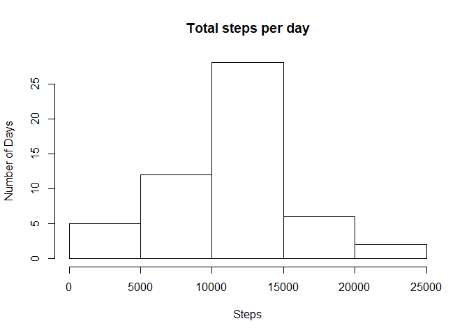
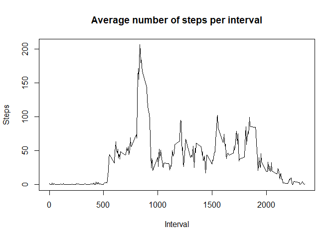
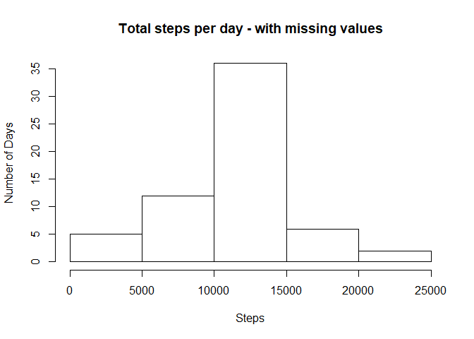
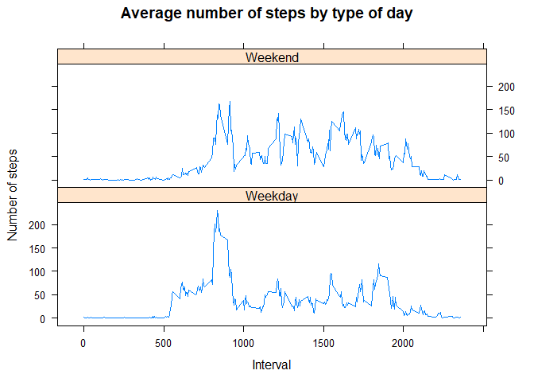

First we'll load the data


```r
activity <- read.csv("activity.csv")
```

## Question 1: What is the mean total number of steps taken per day?

### Calculate the total number of steps taken per day


```r
totalsteps <- aggregate(steps~date, activity, sum, na.rm=TRUE)
```

### Make a histogram of the total number of steps taken each day


```r
hist(totalsteps$steps, xlab = "Steps", ylab = "Number of Days", main = "Total steps per day")
```

<!-- -->

### Calculate and report the mean and median of the total number of steps taken per day


```r
mean <- mean(totalsteps$steps)
mean
```

```
## [1] 10766.19
```

```r
median <- median(totalsteps$steps)
median
```

```
## [1] 10765
```

## Question 2: What is the average daily activity pattern?

### Make a time series plot (i.e.type = "l") of the 5-minute interval (x-axis) and the average number of steps taken, averaged across all days (y-axis)


```r
averagesteps <- aggregate(activity$steps, by=list(activity$interval), FUN = mean, na.rm=TRUE)
names(averagesteps) <- c("interval", "mean")
plot(averagesteps$interval, averagesteps$mean, type = "l", xlab = "Interval", ylab = "Steps", main = "Average number of steps per interval")
```

<!-- -->

### Which 5-minute interval, on average across all the days in the dataset, contains the maximum number of steps?


```r
averagesteps[which.max(averagesteps[,2]),1]
```

```
## [1] 835
```

## Question 3: Imputing missing values

### Calculate and report the total number of missing values in the dataset


```r
sum(is.na(activity))
```

```
## [1] 2304
```

### Devise a strategy for filling in all of the missing values in the dataset


```r
library(plyr)
stepsbyinterval <- tapply(activity$steps, activity$interval, mean, na.rm=TRUE)
activitynew <- split(activity, activity$interval)
```

### Create a new dataset that is equal to the original dataset but with the missing data filled in.


```r
for(i in 1:length(activitynew)){
        activitynew[[i]]$steps[is.na(activitynew[[i]]$steps)] <- stepsbyinterval[i]
}
activity2 <- do.call("rbind", activitynew)
activity2 <- activity2[order(activity2$date) ,]
head(activity2)
```

```
##          steps       date interval
## 0.1  1.7169811 2012-10-01        0
## 5.2  0.3396226 2012-10-01        5
## 10.3 0.1320755 2012-10-01       10
## 15.4 0.1509434 2012-10-01       15
## 20.5 0.0754717 2012-10-01       20
## 25.6 2.0943396 2012-10-01       25
```

### Make a histogram of the total number of steps taken each day and Calculate and report the mean and median total number of steps taken per day.


```r
totalsteps1 <- aggregate(steps~date, activity2, sum)
hist(totalsteps1$steps, xlab = "Steps", ylab = "Number of Days", main = "Total steps per day - with missing values")
```

<!-- -->

```r
mean1 <- mean(totalsteps1$steps)
mean1
```

```
## [1] 10766.19
```

```r
median1 <- median(totalsteps1$steps)
median1
```

```
## [1] 10766.19
```

### Do these values differ from the estimates from the first part of the assignment? What is the impact of imputing missing data on the estimates of the total daily number of steps?

No change in mean, but the median has increased slightly. Imputing missing data does not impact estimates of total daily number of steps. 


## Question 4: Are there differences in activity patterns between weekdays and weekends?


### Create a new factor variable in the dataset with two levels – “weekday” and “weekend” indicating whether a given date is a weekday or weekend day.


```r
activity2$date <- as.Date(strptime(activity2$date, format="%Y-%m-%d"))
activity2$datetype <- sapply(activity2$date, function(x) {
        if (weekdays(x) == "Saturday" | weekdays(x) =="Sunday") 
        {y <- "Weekend"} else 
        {y <- "Weekday"}
        y
})
head(activity2)
```

```
##          steps       date interval datetype
## 0.1  1.7169811 2012-10-01        0  Weekday
## 5.2  0.3396226 2012-10-01        5  Weekday
## 10.3 0.1320755 2012-10-01       10  Weekday
## 15.4 0.1509434 2012-10-01       15  Weekday
## 20.5 0.0754717 2012-10-01       20  Weekday
## 25.6 2.0943396 2012-10-01       25  Weekday
```


### Make a panel plot containing a time series plot (i.e. type = "l") of the 5-minute interval (x-axis) and the average number of steps taken, averaged across all weekday days or weekend days (y-axis).


```r
meantotalsteps1 <- ddply(activity2, .(interval, datetype), summarise, Avg = mean(steps))
library(lattice)
xyplot(Avg~interval | datetype, data = meantotalsteps1, type = "l", layout = c(1,2), xlab = "Interval", ylab = "Number of steps", main = "Average number of steps by type of day")
```

<!-- -->

